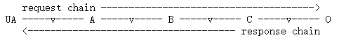

# HTTP 1.1版本
## 第一章 HTTP概述
### 1.1 HTTP的系统组成
&emsp;&emsp;HTTP是一个客户端——服务器协议：请求有一个实体，即用户代理(user agent)，或是一个可以代表它的代理方(proxy)发出。每个请求都会被发送到一个服务器，它会处理这个请求并提供一个称作响应的回复。在客户端与服务器之间，还有许许多多的被称为代理的实体，履行不同的作用，例如充当网关或缓存。  

  

  
&emsp;&emsp;如图，在一个请求/响应中出现一个或者多个中介时，就是复杂的情况了。中介有三种常见形式：代理、网关和隧道。代理是一个转发代理，接收以绝对形式的 URI 发送的请求，重写消息的全部或部分，并将重新格式化的请求转发到由 URI 标识的服务器。网关是一个接收代理，可作为其他某些服务器的一层，有必要时将请求转换为基础服务器的协议。隧道充当两个连接之间的中继点，不改变消息；当通信需要通过中介（如防火墙）传递时，会使用隧道，即使中介不能理解消息的内容。

### 1.2 HTTP的基本性质
- **HTTP是简约的**：HTTP报文能被人读懂并理解，向开发者提供了简单的测试方式。(在HTTP 2.0中，HTTP报文消息被封装进入帧，这点引入了额外的复杂度)
- **HTTP是可扩展的**： HTTP 标头让该协议易于扩展和实验。只要服务器客户端之间对新标头的语义经过简单协商，新功能就可以被加入进来。
- **HTTP无状态，但有会话**：无状态：在同一个连接中，前后两个执行成功的请求之间是没有关系的。**基于Cookie的Session**：采用Session(服务端)、Sessionid(标识符)和Cookie 被加入协议工作流程，每个请求之间就能创建会话，让每个请求都能共享上下文信息或相同的状态。**基于Token的Session.....**
- **HTTP和连接**：由传输层来控制，仅仅需要传输层是可靠的，或不会丢失消息。在 HTTP/1.1 里，默认就是长连接的。
  
### 1.3 HTTP能控制什么
- **缓存**：服务端能指示代理和客户端缓存哪些内容以及缓存多长时间，客户端能够指示中间的缓存代理来忽略已存储的文档。
- **开放同源限制**：
- **认证**：一些页面可能会被保护起来，仅让特定的用户进行访问。
- **代理服务器和隧道**：服务器或客户端常常是处于内网的，对其他计算机隐藏真实 IP 地址。因此 HTTP 请求就要通过代理服务器越过这个网络屏障。

## 第二章 HTTP的请求——响应
### 2.1 HTTP会话
- **建立连接**：TCP三次握手
- **发送请求**：客户端向服务器发送请求，请求中包含要访问的资源的 URL、请求方法（GET、POST、PUT、DELETE 等）、请求头（例如，Accept、User-Agent）以及可选的请求体（对于 POST 或 PUT 请求）。
- **处理请求**：服务器处理请求并送回应答，回应包括一个状态码和对应的数据。
- **关闭连接**：TCP四次挥手。
### 2.2 HTTP请求

  

 

- **起始行**(start-line)：三元素。一个HTTP方法、一个请求目标和HTTP版本。
- **标头**(Header)：**通用标头(General header)** 适用于请求消息和响应消息。**请求标头(Request header)** 通过进一步的定义给定上下文给或者进行有条件的限制来修饰请求。**表示标头(Representation header)** 描述了消息数据的原始格式和应用编码(仅在消息有主体时才存在)。
- **主体**(Body)：常见的POST请求会有主体。主体大致可分为两类：单一资源主体和多资源主体

### 2.3 HTTP响应

  

 

- **状态行**(status-line)：三元素。一个HTTP版本、一个状态码和状态文本。
- **标头**(Header)：**通用标头(General header)** 适用于请求消息和响应消息。**请求标头(Request header)** 提供有关服务器的其他信息，这些消息不适合状态行。**表示标头(Representation header)** 描述了消息数据的原始格式和应用编码(仅在消息有主体时才存在)。
- **主体**(Body)：主体大致可分为三类：单一资源主体，由*已知* s长度的单个文件组成该类型主体由两个标头定义：Content-Type 和 Content-Length。单资源主体，由*未知* 长度的单个文件组成通过将Transfer-Encoding 设置为 chunked 来使用分块编码。多资源主体，由多部份body组成，每个部分包含不同的信息段。

## 第三章 HTTP重要功能

### 3.1 HTTP 安全

### 3.1 HTTP 控制访问(CORS)
&emsp;&emsp;跨源资源共享（CORS，或通俗地译为跨域资源共享）是一种基于 HTTP 头的机制，该机制通过允许服务器标示除了它自己以外的其他源（域、协议或端口），使得浏览器允许这些源访问加载自己的资源。跨源资源共享还通过一种机制来检查服务器是否会允许要发送的真实请求，该机制通过浏览器发起一个到服务器托管的跨源资源的“预检”请求。在预检中，浏览器发送的头中标示有 HTTP 方法和真实请求中会用到的头。

  

&emsp;&emsp;如图所示在`https://domian-a.com`的 JavaScrip 代码对`https://domain-b.com/data.json`发出了请求，但出于安全性，浏览器对于脚本内发出的**跨源HTTP请求**进行了限制。这意味着使用 API 的 Web 应用程序只能从加载应用程序的同一个域请求 HTTP 资源，除非响应报文包含了正确 CORS 响应头。CORS 机制允许 Web 应用服务器进行跨源访问控制，从而使跨源数据传输得以安全进行。

### 3.2 HTTP 认证
&emsp;&emsp;HTTP 提供一个用于权限控制和认证的通用框架。下面步骤介绍了通用的 HTTP 认证框架，服务器可以用来质询（challenge）客户端的请求，客户端则可以提供身份验证凭据。：
&emsp;&emsp;1.服务器端向客户端返回 401（Unauthorized，未被授权的）响应状态码，并在 WWW-Authenticate 响应标头提供如何进行验证的信息，其中至少包含有一种质询方式。
&emsp;&emsp;2.之后，想要使用服务器对自己身份进行验证的客户端，可以通过包含凭据的 Authorization 请求标头进行验证。
&emsp;&emsp;3.通常，客户端会向用户显示密码提示，然后发送包含正确的 Authorization 标头的请求。
### 3.3 HTTP 缓存
#### 3.3.1 概览
&emsp;&emsp;HTTP通常用于分布信息系统，在这些系统中，可以通过使用响应缓存来提高性能。 HTTP/1.1协议包括许多旨在使缓存尽可能工作的元素。由于这些元素与协议的其他方面密不可分，并且彼此互动，因此有必要将HTTP的基本缓存设计与方法、标题、响应代码等的详细描述分开描述。
&emsp;&emsp;HTTP/1.1 中缓存的目标是在许多情况下消除发送请求的需要，并在许多其他情况下消除发送完整响应的需要。前者减少了许多操作所需的网络往返次数；我们使用 **"expiration"(过期)** 机制来实现这一目的。后者减少了网络带宽要求；我们使用 **"validation"(验证)** 机制来实现这一目的。
#### 3.3.2 不同种类的缓存

### 3.4 HTTP 压缩

### 3.5 HTTP 条件请求

### 3.6 HTTP 内容协商

### 3.7 HTTP Cookie

### 3.8 HTTP 范围请求

### 3.9 HTTP 重定向

## 第四章 HTTP基本内容（联系REST）
### 4.1 HTTP的主要方法
- GET(幂等)：请求获取资源。————REST资源查询  

      E.g：GET /index.html
- POST(不是幂等)：请求服务器接收并处理请求体中的数据，常用于表单提交。————REST资源的创建  

      E.g:  POST /users HTTP/1.1
            Host: api.example.com
            Content-Type: application/json

            {
            "name": "John Doe",
            "age": 30,
            "email": "john.doe@example.com"
            }

- PUT(幂等)：请求服务器存储一个资源，并用请求体中的内容替换目标资源的所有内容。————REST资源的更新  
  
      E.g： PUT /users/1 HTTP/1.1
            Host: api.example.com
            Content-Type: application/json

            {
            "name": "John Doe",
            "age": 31,
            "email": "john.doe@example.com"
            }

- PATCH(不是幂等)：PATCH用于更新部分资源。当客户端使用 PATCH 方法向服务器发送请求时，服务器将更新与请求 URI 相关联的资源的部分属性。————REST资源的更新  

      E.g：PATCH /users/1 HTTP/1.1
           Host: api.example.com
           Content-Type: application/json

           {
              "age": 31
           }       
           
- DELETE(幂等):请求　服务器删除指定资源。————REST资源的删除。  
  
      E.g: DELETE /file.html HTTP/1.1
　
  
### 4.2 HTTP的返回状态码
- 1xx：表示接收的请求正在处理。————REST并没有使用
- 2xx：表示请求正常处理完毕。
- 3xx：需要后续操作才能完成这一请求。
- 4xx：表示请求包含语法错误或无法完成.
- 5xx：服务器在处理请求的过程中发生了错误。　 
　

  

 

**HTTTPS**  

&emsp;&emsp;HTTPS(端口 **443**) = HTTP(端口 **80**) + SSL/TLS  
