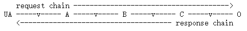
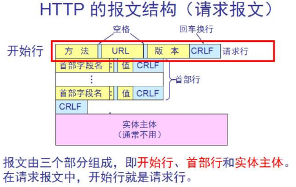
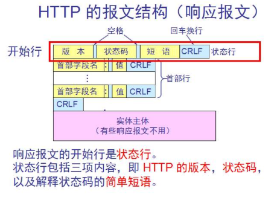

# HTTP 1.1版本
## 第一章 HTTP概述
### 1.1 HTTP的系统组成
&emsp;&emsp;HTTP是一个客户端——服务器协议：请求有一个实体，即用户代理(user agent)，或是一个可以代表它的代理方(proxy)发出。每个请求都会被发送到一个服务器，它会处理这个请求并提供一个称作响应的回复。在客户端与服务器之间，还有许许多多的被称为代理的实体，履行不同的作用，例如充当网关或缓存。  

  

  
&emsp;&emsp;如图：A、B 和 C 为中介，v 为链路。在一个请求/响应中出现一个或者多个中介时，就是复杂的情况了。中介有三种常见形式：代理、网关和隧道。代理是一个转发代理，接收以绝对形式的 URI 发送的请求，重写消息的全部或部分，并将重新格式化的请求转发到由 URI 标识的服务器。网关是一个接收代理，可作为其他某些服务器的一层，有必要时将请求转换为基础服务器的协议。隧道充当两个连接之间的中继点，不改变消息；当通信需要通过中介（如防火墙）传递时，会使用隧道，即使中介不能理解消息的内容。

### 1.2 HTTP的基本性质
- **HTTP是简约的**：HTTP报文能被人读懂并理解，向开发者提供了简单的测试方式。(在HTTP 2.0中，HTTP报文消息被封装进入帧，这点引入了额外的复杂度)
- **HTTP是可扩展的**： HTTP 标头让该协议易于扩展和实验。只要服务器客户端之间对新标头的语义经过简单协商，新功能就可以被加入进来。
- **HTTP无状态，但有会话**：无状态：在同一个连接中，前后两个执行成功的请求之间是没有关系的。**基于Cookie的Session**：采用Session(服务端)、Sessionid(标识符)和Cookie 被加入协议工作流程，每个请求之间就能创建会话，让每个请求都能共享上下文信息或相同的状态。**基于Token的Session.....**
- **HTTP和连接**：由传输层来控制，仅仅需要传输层是可靠的，或不会丢失消息。在 HTTP/1.1 里，默认就是长连接的。
  
### 1.3 HTTP能控制什么
- **缓存**：服务端能指示代理和客户端缓存哪些内容以及缓存多长时间，客户端能够指示中间的缓存代理来忽略已存储的文档。
- **开放同源限制**：
- **认证**：一些页面可能会被保护起来，仅让特定的用户进行访问。
- **代理服务器和隧道**：服务器或客户端常常是处于内网的，对其他计算机隐藏真实 IP 地址。因此 HTTP 请求就要通过代理服务器越过这个网络屏障。

## 第二章 HTTP的请求——响应
### 2.1 HTTP会话
- **建立连接**：TCP三次握手
- **发送请求**：客户端向服务器发送请求，请求中包含要访问的资源的 URL、请求方法（GET、POST、PUT、DELETE 等）、请求头（例如，Accept、User-Agent）以及可选的请求体（对于 POST 或 PUT 请求）。
- **处理请求**：服务器处理请求并送回应答，回应包括一个状态码和对应的数据。
- **关闭连接**：TCP四次挥手。
### 2.2 HTTP请求

  

 

- **起始行**(start-line)：三元素：一个HTTP方法、一个请求目标和HTTP版本。
- **标头**(Header)：**通用标头(General header)** 适用于请求消息和响应消息。**请求标头(Request header)** 通过进一步的定义给定上下文给或者进行有条件的限制来修饰请求。**表示标头(Representation header)** 描述了消息数据的原始格式和应用编码(仅在消息有主体时才存在)。
- **主体**(Body)：常见的POST请求会有主体。主体大致可分为两类：单一资源主体和多资源主体

### 2.3 HTTP响应

  

 

- **状态行**(status-line)：三元素：一个HTTP版本、一个状态码和状态文本。
- **标头**(Header)：**通用标头(General header)** 适用于请求消息和响应消息。**请求标头(Request header)** 提供有关服务器的其他信息，这些消息不适合状态行。**表示标头(Representation header)** 描述了消息数据的原始格式和应用编码(仅在消息有主体时才存在)。
- **主体**(Body)：主体大致可分为三类：单一资源主体，由*已知* s长度的单个文件组成该类型主体由两个标头定义：Content-Type 和 Content-Length。单资源主体，由*未知* 长度的单个文件组成通过将Transfer-Encoding 设置为 chunked 来使用分块编码。多资源主体，由多部份body组成，每个部分包含不同的信息段。

## 第三章 HTTP重要功能

### 3.1 HTTP 安全

### 3.1 HTTP 控制访问(CORS)
&emsp;&emsp;跨源资源共享（CORS，或通俗地译为跨域资源共享）是一种基于 HTTP 头的机制，该机制通过允许服务器标示除了它自己以外的其他源（域、协议或端口），使得浏览器允许这些源访问加载自己的资源。跨源资源共享还通过一种机制来检查服务器是否会允许要发送的真实请求，该机制通过浏览器发起一个到服务器托管的跨源资源的“预检”请求。在预检中，浏览器发送的头中标示有 HTTP 方法和真实请求中会用到的头。

  

&emsp;&emsp;如图所示在`https://domian-a.com`的 JavaScrip 代码对`https://domain-b.com/data.json`发出了请求，但出于安全性，浏览器对于脚本内发出的**跨源HTTP请求**进行了限制。这意味着使用 API 的 Web 应用程序只能从加载应用程序的同一个域请求 HTTP 资源，除非响应报文包含了正确 CORS 响应头。CORS 机制允许 Web 应用服务器进行跨源访问控制，从而使跨源数据传输得以安全进行。

### 3.2 HTTP 认证
&emsp;&emsp;HTTP 提供一个用于权限控制和认证的通用框架。下面步骤介绍了通用的 HTTP 认证框架，服务器可以用来质询（challenge）客户端的请求，客户端则可以提供身份验证凭据：  
&emsp;&emsp;1.服务器端向客户端返回 401（Unauthorized，未被授权的）响应状态码，并在 WWW-Authenticate 响应标头提供如何进行验证的信息，其中至少包含有一种质询方式。  
&emsp;&emsp;2.之后，想要使用服务器对自己身份进行验证的客户端，可以通过包含凭据的 Authorization 请求标头进行验证。  
&emsp;&emsp;3.通常，客户端会向用户显示密码提示，然后发送包含正确的 Authorization 标头的请求。
### 3.3 HTTP 缓存
#### 3.3.1 概览
&emsp;&emsp;HTTP通常用于分布信息系统，在这些系统中，可以通过使用响应缓存来提高性能。 HTTP/1.1协议包括许多旨在使缓存尽可能工作的元素。由于这些元素与协议的其他方面密不可分，并且彼此互动，因此有必要将HTTP的基本缓存设计与方法、标题、响应代码等的详细描述分开描述。
&emsp;&emsp;HTTP/1.1 中缓存的目标是在许多情况下消除发送请求的需要，并在许多其他情况下消除发送完整响应的需要。前者减少了许多操作所需的网络往返次数；我们使用 **"expiration"(过期)** 机制来实现这一目的。后者减少了网络带宽要求；我们使用 **"validation"(验证)** 机制来实现这一目的。

#### 3.3.2 expiration(过期)
&emsp;&emsp;存储的 HTTP 响应有两种状态：fresh 和 stale。fresh 状态通常表示响应仍然有效，可以重复使用，而 stale 状态表示缓存的响应已经过期。在HTTP/1.1中采用`max-age`指令，指定了允许重用缓存的response的最长时间（以秒为单位）。例如，max-age=60表示response可以缓存，并且在接下来的60s内可以被重用，无需发出新的request请求。
#### 3.3.3 validation(验证)
&emsp;&emsp;过时的响应不会立即被丢弃。HTTP 有一种机制，可以通过询问源服务器将陈旧的响应转换为新的响应。这称为验证，有时也称为重新验证。
&emsp;&emsp;验证是通过使用包含`If-Modified-Since`或 `If-None-Match`请求标头的条件请求完成的。

      1.使用 max-age/If-Modified-Since 的时候，如果内容没有更改，服务器响应 304 Not Modifird 。
      2.使用 ETag/If-None-Match 的时候，如果服务器为请求的资源确定的 ETag 标头的值与请求中的 If-None-Match 值相同，
      则服务器将返回 304 Not Modified。但是，如果服务器确定请求的资源现在应该具有不同的 ETag 值，
      则服务器将其改为 200 OK 和资源的最新版本进行响应。
#### 3.3.5 不同种类的缓存
&emsp;&emsp;**私有缓存**是绑定到特定哭护短的缓存————通常是浏览器缓存。由于存储的响应不与其他客户端共享，因此私有缓存可以存储该用户的个性化响应。

     HTTP响应： Cache-Control: private
&emsp;&emsp;**共享缓存**是位于客户端与服务端之间，可以存储用户之间共享的响应。共享缓存可以进一步细分为**代理缓存**和**托管缓存**。    
&emsp;&emsp;1.代理缓存：除了访问控制的功能外，一些代理还实现了缓存以减少网络流量。  

      Cache-Control: no-store, no-cache, max-age=0, must-revalidate, proxy-revalidate （全实现）
      no-store：指示缓存不应存储任何关于请求/响应的内容。
      no-cache：指示缓存不应使用缓存的内容，而是每次都需要向服务器发送请求进行验证。该指令不会阻止存储响应，而是阻止在不重新验证的情况下重用响应
      max-age=0：指示缓存中的内容已经过期，需要向服务器发送请求进行验证。
      must-revalidate：指示缓存在过期后必须向服务器发送请求进行验证。
      proxy-revalidate：指示代理服务器在缓存内容过期后必须向原始服务器发送请求进行验证。

&emsp;&emsp;2.托管缓存：托管缓存由服务开发人员明确部署，以降低源服务器负载并有效地交付内容。

      Cache-Control: no-store

### 3.4 HTTP 压缩
&emsp;&emsp;数据压缩是提高 Web 站点性能的一种重要手段。对于有些文件来说，高达 70% 的压缩比率可以大大减低对于带宽的需求。用于文件的压缩算法可以大致分为两类：  
- **无损压缩**：在压缩与解压缩的循环期间，不会对要恢复的数据进行修改。复原后的数据与原始数据是一致的（比特与比特之间一一对应）。如：图片文件`gif`或者`ping`
- **有损压缩**：在压缩与解压缩的循环期间，会对原始数据进行修改，但是会（希望）以用户无法觉察的方式进行。如：网络上的视频文件，`jpeg`格式的图片。

### 3.5 HTTP 条件请求
&emsp;&emsp;在 HTTP 中有一个条件请求的概念，在这类请求中，请求的结果，甚至请求成功的状态，都会随着验证器与受影响资源的比较结果的变化而变化。这类请求可以用来验证缓存的有效性，省去不必要的控制手段，以及验证文件的完整性，例如在断点续传的场景下或者在上传或者修改服务器端的文件的时候避免更新丢失问题。
#### 3.5.1 基本原理
&emsp;&emsp;在 HTTP 协议中，条件请求指的是请求的执行结果会因特定首部的值不同而不同。这些首部规定了请求的前置条件，请求结果则视条件匹配与否而有所不同。
#### 3.5.2 验证器
&emsp;&emsp;所有的条件请求首部都是试图去检测服务器上存储的资源是否与某一特定版本相匹配。而验证器的类型分为两大类:文件最后修改时间 `last-modified` 和 实体标签 `ETag`。  
&emsp;&emsp;比较同一份资源的不同版本有一定的技巧性：取决于上下文环境的不同，有两种不同的等值检查类型：  
- *强验证类型（Strong validation）* 应用于需要逐个字节相对应的情况，例如需要进行断点续传的时候
- *弱验证类型（Weak validation）* 应用于用户代理只需要确认资源内容相同即可。即便是有细微差别也可以接受，比如显示的广告不同，或者是页脚的时间不同。
#### 3.5.3 条件首部

      If-Match
      如果远端资源的实体标签与在 ETag 这个首部中列出的值相同的话，表示条件匹配成功。默认地，除非实体标签带有 'W/' 前缀，否者它将会执行强验证。

      If-None-Match
      如果远端资源的实体标签与在 ETag 这个首部中列出的值都不相同的话，表示条件匹配成功。默认地，除非实体标签带有 'W/' 前缀，否者它将会执行强验证。

      If-Modified-Since
      如果远端资源的 Last-Modified 首部标识的日期比在该首部中列出的值要更晚，表示条件匹配成功。

      If-Unmodified-Since
      如果远端资源的 HTTPHeader("Last-Modified")}} 首部标识的日期比在该首部中列出的值要更早或相同，表示条件匹配成功。

      If-Range
      与 If-Match 或 If-Unmodified-Since 相似，但是只能含有一个实体标签或者日期值。如果匹配失败，则条件请求宣告失败，此时将不会返回 206 Partial Content 响应码，而是返回 200 OK 响应码，以及完整的资源。
### 3.6 HTTP 内容协商
&emsp;&emsp;在 HTTP 协议中，内容协商是一种机制，用于为同一 URI 提供资源不同的表示形式，以帮助用户代理指定最适合用户的表示形式（例如，哪种文档语言、哪种图片格式或者哪种内容编码）。
&emsp;&emsp;最佳表示形式的选取可以通过两种机制实现：
- 客户端设置特定的 HTTP 标头（又称为服务端驱动型内容协商或者主动内容协商），这是进行内容协商的标准方式。
- 服务器返回 `300（Multiple Choices）或者 406（Not Acceptable）、415（Unsupported Media Type）HTTP 响应状态码 （又称为代理驱动型协商或者响应式协商）`，这种方式一般用作备选方案。

### 3.7 HTTP Cookie
#### 3.7.1 Cookie 概述
&emsp;&emsp;HTTP Cookie（也叫 Web Cookie 或浏览器 Cookie）是服务器发送到用户浏览器并保存在本地的一小块数据。浏览器会存储 cookie 并在下次向同一服务器再发起请求时携带并发送到服务器上。通常，它用于告知服务端两个请求是否来自同一浏览器——如保持用户的登录状态。Cookie 使基于无状态的 HTTP 协议记录稳定的状态信息成为了可能。  
&emsp;&emsp;Cookie主要用于三个方面：会话状态管理、个性化设置、浏览器行为跟踪。
#### 3.7.2 Cookie创建
&emsp;&emsp;服务器使用 Set-Cookie 响应头部向用户代理（一般是浏览器）发送 Cookie 信息。一个简单的 Cookie 可能像这样：  

      Set-Cookie: <cookie-name>=<cookie-value>
&emsp;&emsp;设置完成之后，对该服务器发起的每一次新请求，浏览器都会将之前保存的 Cookie 信息通过 Cookie 请求头部再发送给服务器。  

      GET /sample_page.html HTTP/1.1
      Host: www.example.org
      Cookie: yummy_cookie=choco; tasty_cookie=strawberry

### 3.8 HTTP 范围请求
&emsp;&emsp;HTTP 的 Range 请求使客户端能够要求服务器仅向其回传 HTTP 消息的一部分。范围请求对于支持随机访问的媒体播放器、明确只需大型文件某部分的数据处理工具，以及允许用户暂停及恢复下载的下载管理器等客户端尤其有用。  
&emsp;&emsp;请求示例：

      GET /example.mp4 HTTP/1.1
      Host: www.example.com
      Range: bytes=0-999
&emsp;&emsp;响应示例：

      HTTP/1.1 206 Partial Content
      Content-Range: bytes 0-999/1234567
      Content-Length: 1000
      Content-Type: video/mp4

      [前1000字节的内容]

### 3.9 HTTP 重定向
&emsp;&emsp;URL 重定向（也称为 URL 转发）是一种为页面、表单或者整个 Web 站点/应用提供多个 URL 地址的技术。HTTP 对此操作有一种特殊类型的响应，称为 HTTP 重定向（HTTP redirect）。  
&emsp;&emsp;在 HTTP 协议中，重定向操作由服务器向请求发送特殊的重定向响应而触发。重定向响应包含以 3 开头的状态码，以及 Location 标头，其保存着重定向的 URL。  
&emsp;&emsp;浏览器在接收到重定向时，它们会立刻加载 Location 标头中提供的新 URL。除了额外的往返操作中会有一小部分性能损失之外，重定向操作对于用户来说是不可见的。

## 第四章 HTTP基本内容（联系REST）
### 4.1 HTTP的主要方法
- GET(幂等)：请求获取资源。————REST资源查询  

      E.g：GET /index.html
- POST(不是幂等)：请求服务器接收并处理请求体中的数据，常用于表单提交。————REST资源的创建  

      E.g:  POST /users HTTP/1.1
            Host: api.example.com
            Content-Type: application/json

            {
            "name": "John Doe",
            "age": 30,
            "email": "john.doe@example.com"
            }

- PUT(幂等)：请求服务器存储一个资源，并用请求体中的内容替换目标资源的所有内容。————REST资源的更新  
  
      E.g： PUT /users/1 HTTP/1.1
            Host: api.example.com
            Content-Type: application/json

            {
            "name": "John Doe",
            "age": 31,
            "email": "john.doe@example.com"
            }

- PATCH(不是幂等)：PATCH用于更新部分资源。当客户端使用 PATCH 方法向服务器发送请求时，服务器将更新与请求 URI 相关联的资源的部分属性。————REST资源的更新  

      E.g：PATCH /users/1 HTTP/1.1
           Host: api.example.com
           Content-Type: application/json

           {
              "age": 31
           }       
           
- DELETE(幂等):请求　服务器删除指定资源。————REST资源的删除。  
  
      E.g: DELETE /file.html HTTP/1.1
　
  
### 4.2 HTTP的返回状态码
- 1xx：表示接收的请求正在处理。————REST并没有使用
- 2xx：表示请求正常处理完毕。
- 3xx：需要后续操作才能完成这一请求。
- 4xx：表示请求包含语法错误或无法完成.
- 5xx：服务器在处理请求的过程中发生了错误。　 

### 4.3 常用状态码
#### 200 OK
&emsp;&emsp;HTTP状态码`200 OK`表明请求已经成功。默认情况下状态码为 200 的响应可以被缓存。
&emsp;&emsp;不同的请求方式对于请求成功的意义如下：
- *GET*: 已经取得资源，并将资源添加到响应的消息体中。
- *HEAD*: 响应的消息体为头部信息。
- *POST*: 响应的消息体中包含此次请求的结果。
- *TRACE*: 响应的消息体中包含服务器接收到的请求信息。
#### 201 Created
&emsp;&emsp;HTTP响应状态码 `201 Created` 是一个代表成功的应答状态码，表示请求已经被成功处理，并且创建了新的资源。新的资源在应答返回之前已经被创建。
&emsp;&emsp;这个状态码的常规使用的场景是作为 *post* 请求的返回值。
#### 202 Accepted
&emsp;&emsp;HTTP响应状态码 `202 Accepted` 表示服务器端已经收到请求消息，但是尚未进行处理。但是对于请求的处理却是无保证的，即稍后无法通过 HTTP 协议给客户端发送一个异步请求来告知其请求的处理结果。这个状态码被设计用来将请求交由另外一个进程或者服务器来进行处理，或者是对请求进行批处理的情形。
&emsp;&emsp;通常表示请求已在后台排队(异步请求)。
#### 204 No Content
&emsp;&emsp;HTTP响应状态码 `204 No Content` 成功状态响应码，表示该请求已经成功了，但是客户端客户不需要离开当前页面。默认情况下 204 响应是可缓存的。
&emsp;&emsp;在 *PUT* 请求中进行资源更新，但是不需要改变当前展示给用户的页面，那么返回 `204 No Content`。如果创建了资源，则返回 `201 Created` 。如果应将页面更改为新更新的页面，则应改用 `200 OK` 。  
&emsp;&emsp;在 *DELETE* 请求中成功通常是 `204 No Content`表示删除成功。
#### 400 Bad Raquest
&emsp;&emsp;HTTP响应状态码 `400 Bad Request` 响应状态码表示服务器因某些被认为是客户端错误的原因（例如，请求语法错误、无效请求消息格式或者欺骗性请求路由），而无法或不会处理该请求。
#### 401 Unauthorized
&emsp;&emsp;HTTP响应状态码 `401 Unauthorized `代表客户端错误，指的是由于缺乏目标资源要求的身份验证凭证，发送的请求未得到满足。这个状态码会与 WWW-Authenticate 首部一起发送，其中包含有如何进行验证的信息。

      E.g: HTTP/1.1 401 Unauthorized
      Date: Wed, 21 Oct 2015 07:28:00 GMT
      WWW-Authenticate: Basic realm="Access to staging site"

#### 403 Forbidden
&emsp;&emsp;HTTP响应状态码 `403 Forbidden` 代表客户端错误，指的是服务器端有能力处理该请求，但是拒绝授权访问。

      401 Unauthorized 与 403 Forbidden 的区别：  
       - 401 Unauthorized 用户身份验证错误，验证成功之后，可改变状态（例如用户的账户密码错误）。
       - 403 Forbidden 即使重新验证也不会改变该状态。该访问是长期禁止的，并且与应用逻辑密切相关（例如没有足够的权限访问该资源）。

#### 404 Not Found
&emsp;&emsp;HTTP 响应状态码 `404 Not Found` 指的是服务器无法找到所请求的资源。*404* 状态码并不能说明请求的资源是临时还是永久丢失。如果服务器知道该资源是永久丢失，那么应该返回 `410（Gone）` 而不是 *404*。

#### 405 Method Not Allowed
&emsp;&emsp;HTTP响应状态码 `405 Method Not Allowed` 表明服务器禁止了使用当前 HTTP 方法的请求（例如服务器没有该方法）。

#### 406 Not Acceptable
&emsp;&emsp;HTTP响应状态码 `406 Not Acceptable` 表示客户端错误，指代服务器端无法提供与 *Accept* 和 *Accept-Language*、 消息头指定的值相匹配的响应。

#### 410 Gone
&emsp;&emsp;HTTP响应状态码 `410 Gone` 说明请求的目标资源在原服务器上不存在了，并且是永久性的丢失。如果不清楚是否为永久或临时的丢失，应该使用 *404*。

#### 422 Unprocessable Entity
&emsp;&emsp;HTTP响应状态码 `422 Unprocessable Entity` 表示服务器理解请求实体的内容类型，并且请求实体的语法是正确的，但是服务器无法处理所包含的指令。

#### 500 Internal Server Error
&emsp;&emsp;HTTP响应状态码 `500 Internal Server Error` 是表示服务器端错误的响应状态码，意味着所请求的服务器遇到意外的情况并阻止其执行请求。  
&emsp;&emsp;这个错误代码是一个通用的“万能”响应代码。有时候，对于类似于 *500* 这样的错误，服务器管理员会更加详细地记录相关的请求信息来防止以后同样错误的出现。

## **HTTTPS**  

&emsp;&emsp;HTTPS(端口 **443**) = HTTP(端口 **80**) + SSL/TLS  
